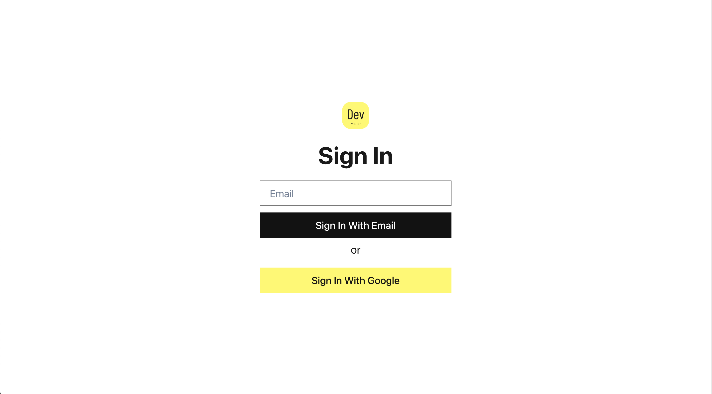
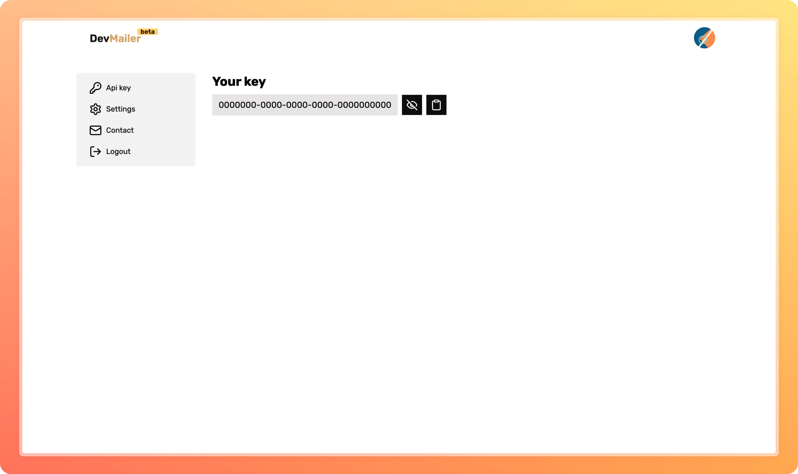
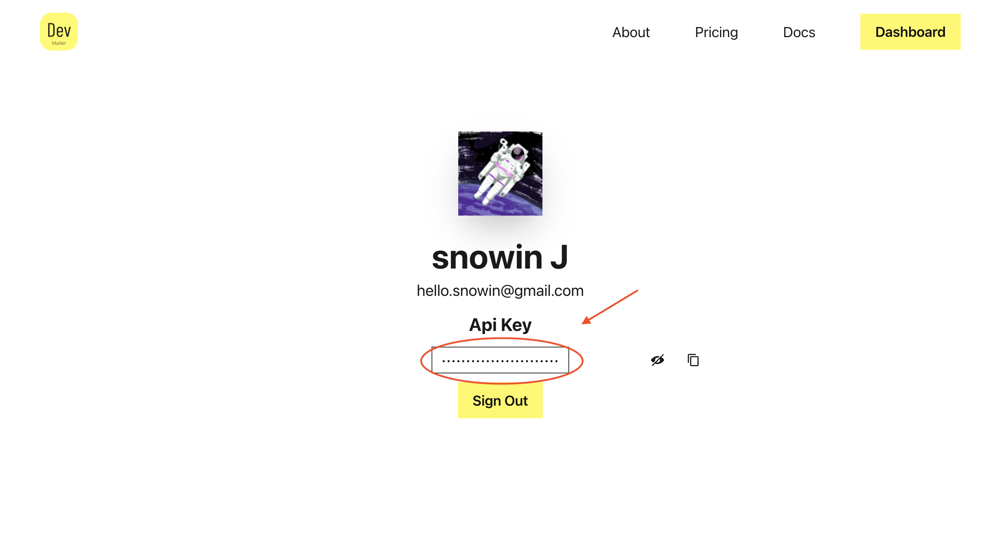

# 🚀 Getting Started

Let's discover about **Dev Mailer in less than 5 minutes**.

## Steps to follow 📖

Let's get started!

### 1. Create a new account
- Go to the <a href="https://devmailer.vercel.app/" target="_blank">DevMailer official site</a>.

- Click on **Get started**

### 2. Complete the registration

### 3. You will be redirected to the dashboord

### 4. Here you can find your api key

Store the api key in ``.env`` file safely.

### That's all, You are good to go 🥳 !

> For any help contact: hello.devmailer@gmail.com
